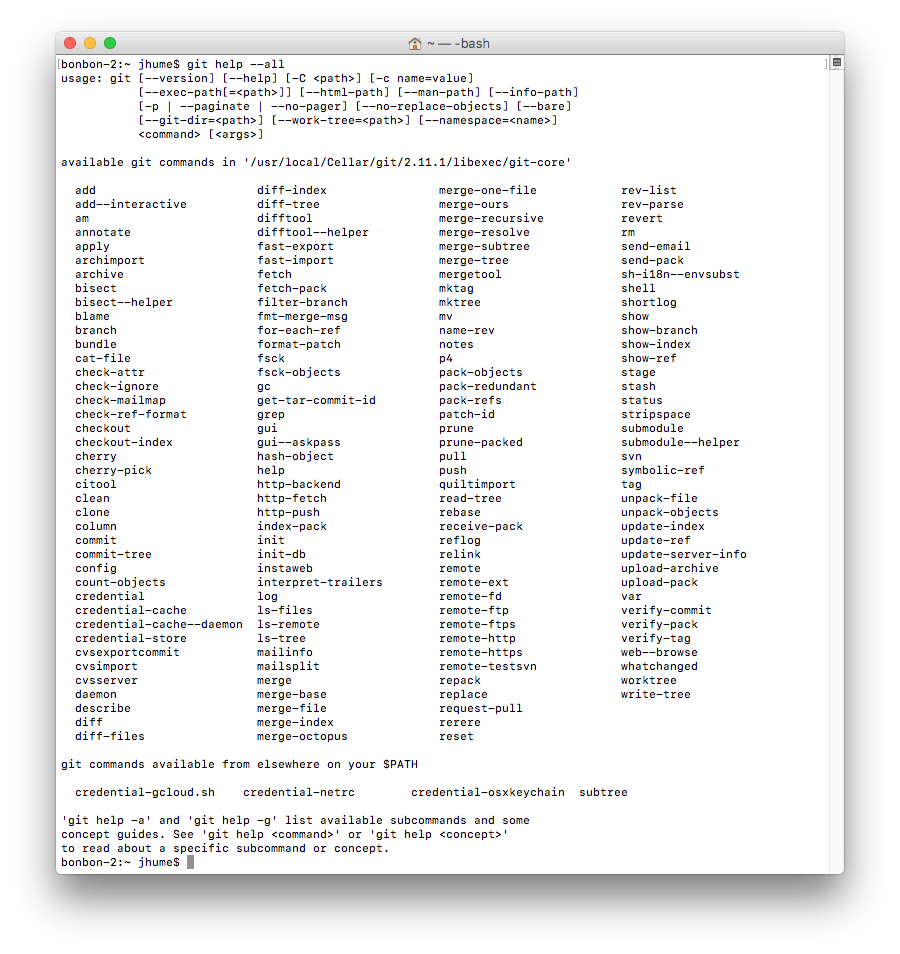
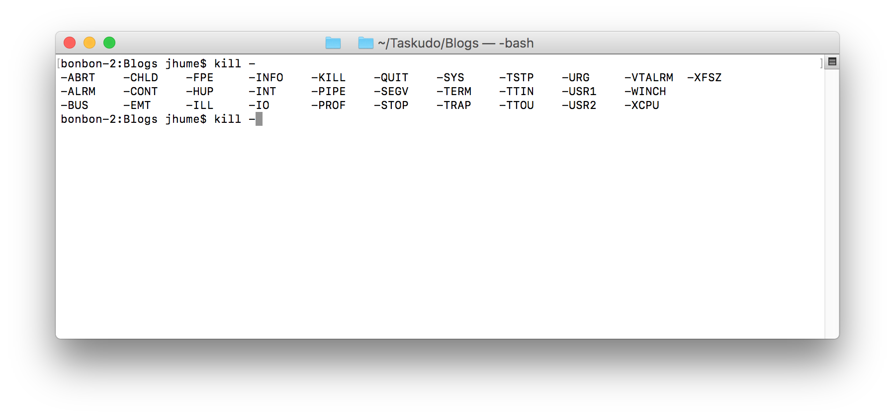

## Background - Why bother?

Back around 1997, the Web wasn’t really a thing, Google didn’t exist and our speech research group at Swansea University were doing our work on small, shared Unix systems mostly using [Dumb Terminals](http://www.pcmag.com/slideshow/story/348634/the-forgotten-world-of-dumb-terminals).

Figure : Your new shiny, circa mid 1990’s

For us word processing meant LaTeX, graphics was Xfig (if we could get on the workstation), or Gnuplot, and we used Vi for editing anything and everything (and were grateful we had enough CPU not to have to use the evil Ex editor ever again). A large proportion of our days was spent interacting with the Operating Systems, for which we used the [C shell](https://en.wikipedia.org/wiki/C_shell).

C shell was allegedly more "user friendly" than Shell. I say allegedly, because although it wasn’t quite punch cards, I don't think most people even back then would have described as properly “user-friendly”. If you typed:

- Part of a command in the terminal and hit tab for autocomplete, tough, you would just get a tab character if you were lucky, or a broken command and a screen of garbage.
-   The wrong command line, and then tried using the left-arrow key to correct the broken part, no joy, it usually messed up the screen again.
-   The wrong command line and hit enter, never mind scroll back in your history to fix it, except, nope, out of luck on that scroll back one as well

It's true, if you were really persistent, you can edit your typo’s on the command line, you just needed to know [arcana about using ‘!’](https://www.washington.edu/computing/unix/history.html). So no problem, just open a browser, find the page using Google, copy the instruction … except, crap, out of luck on that one, no Google and indeed no browser.

Eventually, we heard about the Tcsh shell, possibly newsgroups, possibly a [computer society](http://history.sucs.org/History 1997-1998) contact or possibly a divine being felt our collective pain and decided to take mercy on us. Whatever, this was a shell the was "interactive" and supposedly much better to work with. So after we’d managed to find somewhere to download from, figured out how to build it and persuaded our local system admin to install it, usability did indeed take a massive step forward.

Obviously, the command line editing deficiencies got fixed, but rather unexpectedly, and for my money, at least as importantly the autocompletion turned out to be a great way for exploring what was on your system. Type a letter, bang the tab key and it would show you your options. Without it and the poking around, how else would I have discovered such gems as Fortune and Xeyes, or more importantly, but less prosaically, remembered half of the things I used the previous day.

Quite a few years have passed since then. No matter how useful they are, the trend seems for the new command line tools to have largely abandoned the [Unix philosophy](http://www.faqs.org/docs/artu/ch01s06.html). Instead of small tightly focused, modular commands that interoperate together. We have ended up with command lines that have grown a plethora of sub-commands. Each of which has their own set of frequently inconsistent, and invariably hard to remember options.

Take the massively popular Git Linux kernel patching and distributed version control system. This is what the list of subcommands looks like for me:

Figure : Git, what happens when a Kernel dev designs a command line user interface for his patching tool.

I’m now using the Bash shell, and this has basic autocompletion enabled out of the box on macOS for me but it hopelessly overwhelmed when dealing with these monoliths. Take Git again, hitting the tab autocomplete key for the command after I’ve type “gi” just gets me “git”. Yay, way to go, it is unable to offer any assistance, or to help me explore, all of the rest of the stuff that I need to type to make a [notoriously difficult](https://stevebennett.me/2012/02/24/10-things-i-hate-about-git/) version control system such as Git work (would you be able to spot this as a [spoof](https://git-man-page-generator.lokaltog.net/)? ).

Git’s not the only tool that’s guilty of this, and to be fair it’s not quite back to the bad old days of the C shell (we have Google and browser tabs now), but the move from a pattern that was:

`command options arguments`

to this

`command options sub-command options arguments`

does end up chewing up screen estate and diverting mental horsepower and typing skills away from whatever it is we are trying to do.

Fortunately, some help is at hand, because although it doesn’t tend to be enabled out of the box, the shells we have at our disposal have got better and it is simple to enable them, at least for Bash on macOS, and that’s what the rest of this post is about.

## Pre-requisites – Working installation of Homebrew

### Needs working Homebrew

You’ll need to have the rather excellent [Homebrew package manager for macOS](https://brew.sh/) installed and working.

They have simple instructions on their website for how to do this, but they will probably only work if you have Xcode installed already.

Once you’ve got it installed you can check it is working by running

brew search

and you should be rewarded with a large list of software that you can
install (my suggestion, if you want to test further would be to try
running brew install fortune, or maybe brew install cowsay).

### You will probably need Xcode as well

It’s been years since I installed Homebrew, but from memory, if you run into problems installing it, then it’s usually because you also need to have the Apple’s Xcode developer tools installed. To do this find, and then install it via the App Store (FWIW, downloading and installing this is likely to be the longest part of the process).

There’s more on Homebrew and fixing the Xcode install problem [over here](https://coolestguidesontheplanet.com/installing-homebrew-on-macos-sierra-package-manager-for-unix-apps/)

## Enhanced bash autocompletion functionality

Enhanced bash autocompletion really comes as two parts. The first is an extension to the Bash shell and the second are sets pf per program configuration files.

At a high level the configuration files tell the Bash extension what a program’s subcommands and options are, and how to query it for additional information should that be useful.

The actual delivery of the configuration files can be a bit messy, because as usual everyone has a standard, just not the same as everyone else’s. Some of the configuration files are independently generated and distributed, whilst others are bundled, or can be generated, from the programs to which they apply.

For completeness, we’ll cover both cases.

## Installing and enabling the autocompletion extension

Bash autocompletion requires the installation of the bash autocompletion extension.

To do this, execute

`brew install bash-completion`

After that completes you will need to ensure that the extension gets picked up by any bash shell that is being started. To do this to you will need a snippet similar to the following, present in your
`~/.bash\_profile`:

	if [ -f $(brew—prefix)/etc/bash_completion ]; then
	. $(brew—prefix)/etc/bash_completion
	fi

NB: It’s [easy to fix](http://superuser.com/a/498336), but be careful when editing this file as it can break your Terminal sessions.

This will then enable Bash autocompletion for any executable that satisfies all of the following:  

1. Has a suitable autocompletion installed either via the default `$(brew—prefix)/etc/bash_completion` or for any additional configurations that it finds in the directory `$(brew—prefix)/etc/bash_completion.d`

1. Homebrew finds the program the configuration refers to has been installed under the brew installation location brew—prefix i.e. it doesn’t work for system default programs such as those installed in /bin, /sbin, /usr/bin, /usr/sbin etc.  

2. The Bash shell’s autocompletion process has been instantiated since the configuration was installed (You can manually trigger this by either opening another terminal or by re-running the bash\_profile manually
i.e.

`. \~/.bash_profile)`

All being well, you should test by typing a command such as “ps” and hitting the tab key a couple of times and you should see the completions for it:

)

### Adding additional autocompletions via Homebrew

The easiest way to add extra autocompletions to your setup is with Homebrew. You can find them with

`brew search completion`

To start with I’d recommend

`brew install bash-completion`

as that’ll give you a whole raft of useful extensions, particularly if you’ve previously done a `brew install git`.

I’m doing quite a bit of work with Docker at the moment, and installed Docker with Homebrew, so 

`brew install docker-completion`

has been a bit of a boon for me as well

### Adding built in autocompletions from programs

Some programs come with the ability to generate or supply their own autocompletions. The two that I know about are kubectl and minikube and they are used for interacting with Kubernetes and Kubernetes test clusters respectively.

Since I installed minikube with Homebrew, I got minikube’s completions working for me by running

[[]{#OLE_LINK14 .anchor}]{#OLE_LINK13 .anchor}minikube completion bash &gt; \$(brew—prefix)/etc/bash completion.d/minikube

Similarly, I’ve ended up with kubectl in /usr/local/bin, so this worked for me:

[[]{#OLE_LINK16 .anchor}]{#OLE_LINK15 .anchor}kubectl completion bash
&gt; \$([[]{#OLE_LINK18 .anchor}]{#OLE_LINK17 .anchor}brew—prefix)/etc/bash\_completion.d/kubectl

### Manually adding other autocompletions

Sometimes Homebrew will not have the autocompletion that you want and it may not be convenient to install the binaries under the brew—prefix directory to use of brew autocompletion inclusion mechanism.

A case in point is with gcloud completions, which come as part of Google’s SDK. They are included in the top level SDK directory, so I end up having them installed as:

/usr/local/google-cloud-sdk/completion.bash.inc

It’s probably not sensible to move them from there, because if I do, they will be likely to go out of date when I pick up updates from Google.

The solution is to independently add these types of things to your \~/.bash\_profile. So, for instance, my bash\_profile contains the following:

GOOGLE\_CLOUD\_SDK\_DIR=/usr/local/google-cloud-sdk

if \[ -f \$GOOGLE\_CLOUD\_SDK\_DIR/completion.bash.inc \]; then source
\$GOOGLE\_CLOUD\_SDK\_DIR/completion.bash.inc; fi

### Not working

1. It’s not been re-instantiated since it was installed, try starting a
new terminal.
1. The executable that you’re trying to use it for isn’t under
brew—prefix. If you’re not sure where on your path it is then try using
which executable\_name to find out.

## Want to know more

The autocompletions are largely written as bash scripts.

If you’d like to know more about this subject, then I thought that the Linux Journal [article on
it](http://www.linuxjournal.com/content/more-using-bash-complete-command) looked like an interesting read.

Once you’ve done there, you could then have a delve into brew—prefix /etc/bash\_completion.d/ or head over to <https://github.com/scop/bash-completion>, before maybe have a go
creating your own.
