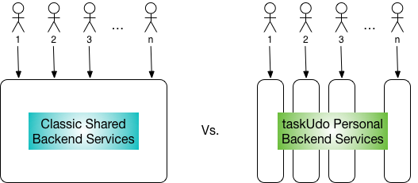

# Plan validation
## Assertions, assertions ...
In order to allow users to works seamlessly across multiple devices, most applications typically consist of one or more native client application that run on Windows, macOS, various mobile platforms, a fallback web app, and a suite of backend services that the clients interact with and persist their data to. 

Each one of the platforms and backend services is rapidly evolving and typically requires a high level of its own expertise to use and maintain. Which, in a business context equates to needing many sets of hands to develop and maintain even relatively simple applications on an ongoing basis.

Developing and maintaining a software product is expensive business. Anything that offers a hope of reducing those costs is worth of investigation.

### Pico-services

Of those costs, a significant proportions come from the efforts to ensure the development and maintenance of backend services that are reliable, performant and secure. 

Get it wrong on the backend and the security and reputation of your enterprise on all platforms is at risk.

Managing deployments in pre and early cloud infrastructure is difficult, usually requires IT's assistance, and is, as a result, an expensive and laborious task. Consequently the pattern that has emerged has been for developers to use a common, Shared Backend Services across all of an application's user base that minimises the need for deployments. 

The plan for taskUdo is not to do this, and is indeed not use Shared Backend Services, instead my assertions are that:

1. Developments in Cloud and Container technology, particularly the emergence of cloud operating system alike technologies such as Kubernetes, mean that it is becoming easy for software developers to programmatically manipulate complete, highly complex and interlinked backend system services (such as DB's, caches, web servers) without IT's routine intervention in a way that has never before been possible.

2.  Much of the security risks, costs and complexity involved in a Shared Backend Services originate from having to make the backend multiuser, using technologies that provide little or no systematic built-in support for this.

3.  The advent of 1. means that it is viable to develop and deploy backend services for individual users, i.e. Personal Backend Services. Further it is preferable to do this because it offers the hope of eliminating most of the problems and costs of 2.

The plan for taskUdo, at least at the moment, is for **taskUdo** to use per-user, **Personal Backend Services.**

'"Classic" Shared vs taskUdo Personal "Pico" Backend Services'

## Plan validation
Clearly, there are other pros and cons to Personal Backend Services as an approach and only time will tell if I am right about my third point above. 

However from the point of view of the immediate plans for taskUdo, although I have spent quite a lot of time researching, I had no practical experience of working with cloud platforms, so for last month or so I have been working on:

1. Validating my assertion that developing and deploying complex services using cloud technologies, is viable, especially for a developer of modest means, i.e. me :-)
2. Gaining insight into the costs of deploying a Personal Backend Service.

(Since basically if those two are no go, then the plan would be scrap). 

To do this I've put myself through my chosen cloud platform's online training before carrying out and exercise to move something non-trivial and possibly useful to taskUdo, first into a local testing cloud and then to a production cloud environment. 

The cloud technology that I have chosen to use is [Kubernetes][1], and my end of course assignment has been to get [Owncloud][2] working on Google's Cloud Platform.

The next blog posts will be about the fun I have had with this.  

[1]:	https://kubernetes.io/
[2]:	https://owncloud.com/

