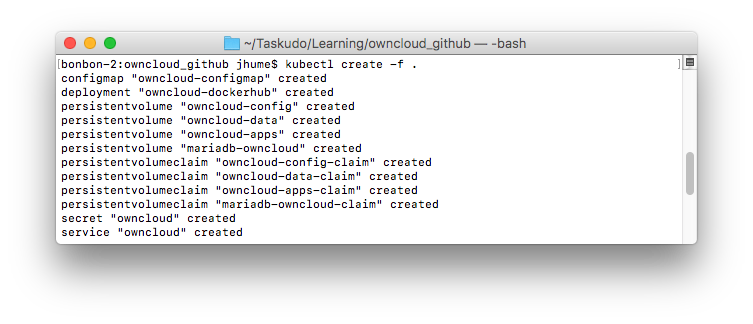
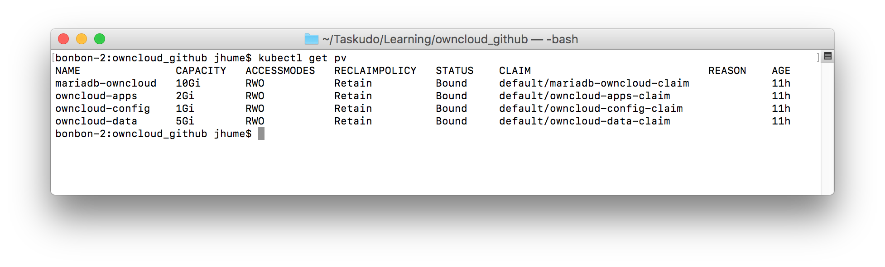
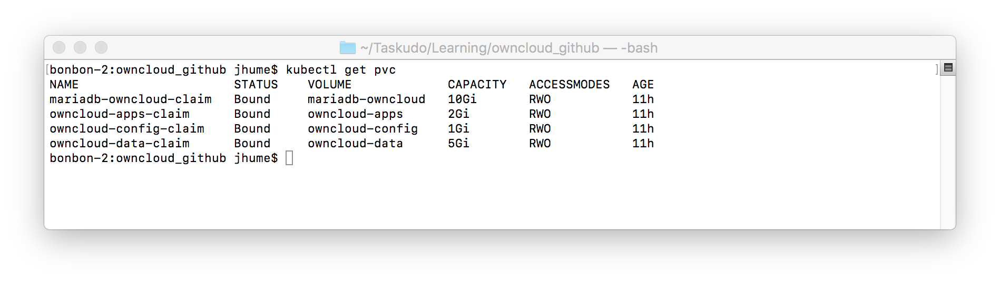
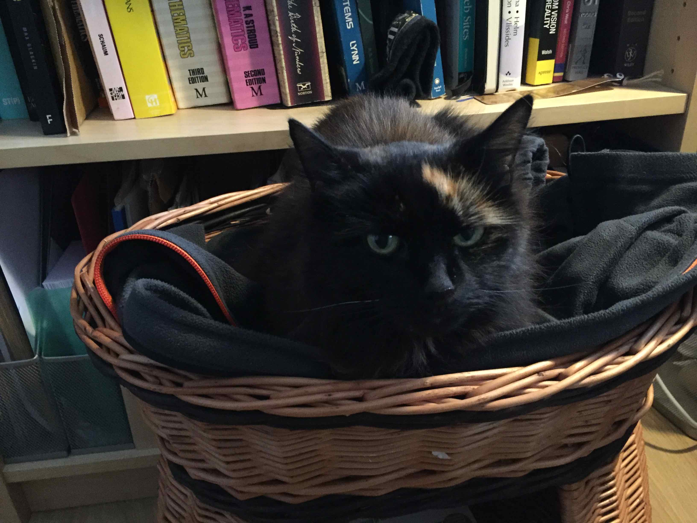

## Introduction and background

In my [last post](https://taskudo.info/blog/fun_with_minikube_bernetes_io_tuts), I documented my experience of bootstrapping a working knowledge of Kubernetes for application deployment, using minikube, and the [official Kubernetes Tutorials](https://kubernetes.io/docs/tutorials/). I undertook this as the first stage of my two-stage plan, where the high-level goals were:

- Address a deficit in practical Kubernetes knowledge.
- Validate to myself, that running applications based on a Personal Backend service approach, might be viable with current cloud technologies.

The next part of this plan called for me to undertake a Kubernetes learning reinforcement exercise. In this exercise the idea would be to attempt to get ownCloud, a non-trivial application, running on Kubernetes:

- Firstly on a local Kubernetes testing cluster provided by [minikube](https://github.com/kubernetes/minikube), then,
- Secondly on a production cloud environment, for which I intended to use the [Google Cloud Platform](https://cloud.google.com).

I'll cover moving to Google's Cloud Platform in a separate post. In the meantime, here's what I did and found out along the way when I got ownCloud working on my test cluster.

### Table of contents and document structure

Essentially it splits up into three sections:

1. Introduction and background, ie. this bit, which aims to cover all the background information and the high-level why's about the exercise.
2. Setting up the minikube environment, the Kubernetes application configuration, how to run it and interact with it, see [Running ownCloud on a minikube Kubernetes cluster](#running-owncloud-on-a-minikube-kubernetes-cluster)
3. Wrapping things up with thoughts, observations etc, see [Closing thoughts and observations](#closing-thoughts-and-observations)

Each of these sections should be self-contained, so if you feel like skipping one or the other, go for it.

- [Getting ownCloud running on a minikube test cluster](#getting-owncloud-running-on-a-minikube-test-cluster)
    - [Introduction and background](#introduction-and-background)
        - [Table of contents and document structure](#table-of-contents-and-document-structure)
        - [Why ownCloud](#why-owncloud)
        - [Background - Exercise goals](#background---exercise-goals)
        - [Initial investigation and implementation plan](#initial-investigation-and-implementation-plan)
        - [Implementation](#implementation)
    - [Running ownCloud on a minikube Kubernetes cluster](#running-owncloud-on-a-minikube-kubernetes-cluster)
        - [How to run the ownCloud application](#how-to-run-the-owncloud-application)
        - [How to clean up afterwards](#how-to-clean-up-afterwards)
        - [Helper scripts](#helper-scripts)
        - [Setup and configuration](#setup-and-configuration)
            - [Creating a minikube Kubernetes environment](#creating-a-minikube-kubernetes-environment)
            - [Obtaining the source code](#obtaining-the-source-code)
            - [Creating Persistent Volumes on the Pod's minikube execution Node](#creating-persistent-volumes-on-the-pods-minikube-execution-node)
        - [Kubernetes configuration](#kubernetes-configuration)
            - [Everything is labelled `app=ownCloud`](#everything-is-labelled-appowncloud)
            - [Persistent Volumes file](#persistent-volumes-file)
            - [Config Maps file](#config-maps-file)
            - [Secrets file](#secrets-file)
            - [Persistent Volume Claims file](#persistent-volume-claims-file)
            - [Services file](#services-file)
            - [Deployments file](#deployments-file)
    - [Closing thoughts and observations](#closing-thoughts-and-observations)
        - [Future improvements](#future-improvements)
        - [How hard is it move other similar applications to Kubernetes?](#how-hard-is-it-move-other-similar-applications-to-kubernetes)
        - [Multiple containers in a single Pod, is it worth it?](#multiple-containers-in-a-single-pod-is-it-worth-it)
        - [Wow](#wow)
        - [And finally ...](#and-finally-)

### Why ownCloud

For this stage of the plan, I wanted to try something that was a better, more substantial, representation of deploying a complete application on Kubernetes [^-1].

[^-1]: My thinking was that if I could get something like this working locally and in the cloud, then, it is unlikely to be a barrier to most others ;-)

I ended up selecting [ownCloud](https://owncloud.org/) [^0] because:

1. Its requirements for spinning up a web server and database are representative of many web applications [^1].
1. There was what looked like a good [official Docker Container](https://hub.docker.com/_/owncloud/) for it.
1. Its technology is interesting; if it works well, then it might be possible to re-use it to simplify taskUdo's development.

[^1]: It is possible to spin the system up quickly with no extra database using a default SQLite DB, however, ownCloud don't recommend using this in a production environment.

### Background - Exercise goals

In addition to the high-level learning goals, at the end of this exercise, I wanted to achieve something that:

1. Did the minimum to get a production deployment running reliably, and, at the same time, did things the _"right way"_.
1. Was likely to be easy to maintain.
1. I wouldn't mind showing to other folks :-)

### Initial investigation and implementation plan

To implement this, I initially considered using the Kubernetes' [Helm project](https://github.com/kubernetes/helm), however, I opted not to because I wanted to focus on the core Kubernetes technology.

After deciding to go with a roll-your-own approach, I then delved into ownCloud's [administration manual](https://doc.owncloud.org/server/latest/admin_manual/installation/index.html) and its [Docker container](https://hub.docker.com/_/owncloud/) documentation to understand available functionality and solidify requirements.

This lead to the following implementation plan:

1. Core Kubernetes functionality only, i.e. no Helm, or similar add-ons.
1. Stick to using the official Docker containers, i.e. no building custom ones.
1. As much as possible, use ownCloud's [`occ`](https://doc.owncloud.org/server/latest/admin_manual/configuration_server/occ_command.html) CLI administration tool to make any changes to the container's default installations to get it working on Kubernetes.
1. Failing that, only use the system tools and accounts that come with the containers, i.e. no `apt-get install something_vital` at run time.
1. Use a database other than SQLite, for which I picked MySQL fork Maria DB [^ellison].
1. Provision four persistent disk volume locations for:
  - [MariaDB](https://hub.docker.com/_/mariadb) to store its database files.  
  - [ownCloud](https://hub.docker.com/_/owncloud) to store its:
      1. Configuration files.
      1. Applications files.
      1. User data files.

[^ellison]: I have some familiarity with MySQL and, at the moment, MariaDB is effectively MySQL without helping to subsidise Mr Ellison's [big expensive toys habit](http://www.superyachtfan.com/larry_ellison.html).

### Implementation

Implementation was then a reasonably simple matter of translating the requirements into something that worked. Initially, I created a solution based on the use of two `Pods`, before re-engineering this to the current single `Pod` solution, which I think is probably more the *right thing*. 

## Running ownCloud on a minikube Kubernetes cluster

The following sub-sections detail:

- How to run the ownCloud example configuration (and clean up afterwards).
- Configuring minikube for the ownCloud application.
- The ownCloud application's Kubernetes configuration.

### How to run the ownCloud application

How to run the ownCloud application:

1. Ensure a working minikube installation, see [Creating a minikube Kubernetes environment](#creating-a-minikube-kubernetes-environment).
1. Retrieve the ownCloud example's application files from [GitHub](https://github.com/shufflingB/learning_k8s_owncloud/tree/minikube_release) and change into the repository's root directory, see [Obtaining the source code](#obtaining-the-source-code).
1. Create storage volumes on minikube's Kubernetes Pod execution Node, either manually, or using the supplied helper script, see  [Creating Persistent Volumes on the Pod's minikube execution Node](#creating-persistent-volumes-on-the-pods-minikube-execution-node).
1. Update the application's configuration with the details of the IP address that minikube will assign to the application, see [Config Maps file](#config-maps-file)
1. Create at least a new encrypted password for the ownCloud 'admin' user account and persist it, see [Secrets file](#secrets-file).
1. In the directory with the Kubernetes YAML configuration files, run the command:  
  `kubectl create -f .`
  
  
1. ... wait a few minutes, whilst the containers are downloaded and things are started, sometimes restarted [^4], and application achieves a stable state in Kubernetes, use `kubectl get pods` to check this.

[^4]: Because the Maria DB and the ownCloud containers are started asynchronously, the ownCloud container can fail to start a few times before  the Maria DB one is operational, particularly on the first run.

1. Once both `Pods` are up (READY 2/2), then running `minikube service owncloud` should open the default browser on the locally hosted ownCloud site. Log in with user 'admin' and password previously set in step 5.

1. Enjoy (hopefully)

### How to clean up afterwards

Each of the Kubernetes objects the configuration creates can be manually removed from the system using the appropriate `kubectl delete k8s_obj_type owncloud_obj_name` command. For example, the following would remove ownCloud `Deployment` and terminate its `Pod` [^del_deployment]:

`kubectl delete deployment owncloud`
  
[^del_deployment]: But leaves  `Service`, `ConfigMap`, `Secret`, `PersistentVolumeClaims` and `PersistentVolumes`.

This can get a bit tedious when experimenting, so there are also two helper scripts available, `reset_k8s.bash` and `zap_EVERYTHING.bash`, these respectively, remove the installation from just Kubernetes or everything from Kubernetes **and** minikube.

### Helper scripts

The example comes with a small selection of rudimentary helper scripts that are intended to make testing a bit easier. These are:

- [`./helpers/create_hostpath_dirs.bash`][18] - This creates the `PersistentVolume` `hostPath` directory structures on minikube's Kubernetes Node by inspecting the contents of the `PersistentVolume` definitions file.
- [`./helpers/mysql_connect_to_mariadb.bash`][19] - Opens a MySQL client on the MariaDB container that is connected as root to the MariaDB instance. (handy for checking and removing the ownCloud DB during testing cycles).
- [`./helpers/reset_k8s.bash`][20] - Removes everything related to the application from Kubernetes, but does not remove the `PersistentVolume` directories from the minikube node.
- [`./helpers/zap_EVERYTHING.bash`][21] - Removes everything related to the application from Kubernetes **and** from the minikube node. In effect, this acts like a `minikube delete` but is a bit quicker and does not cause the IP address to change.

[18]: https://github.com/shufflingB/learning_k8s_owncloud/blob/minikube_release/helpers/create_hostpath_dirs.bash
[19]: https://github.com/shufflingB/learning_k8s_owncloud/blob/minikube_release/helpers/mysql_connect_to_mariadb.bash
[20]: https://github.com/shufflingB/learning_k8s_owncloud/blob/minikube_release/helpers/reset_k8s.bash
[21]: https://github.com/shufflingB/learning_k8s_owncloud/blob/minikube_release/helpers/zap_EVERYTHING.bash

**Warning**: The helper scripts really are quite basic and liable to break if things get renamed, moved around etc. Some are also, by their nature, **destructive to operational systems**, the upshot of this is that if you use them, then **use with caution**.  

So, if you have read through the helper script and are happy to proceed, they can be invoked from repository directory using:

`bash ./helpers/helper_script_name`

### Setup and configuration

#### Creating a minikube Kubernetes environment
These instructions are based on using minikube and its management of a Kubernetes test clusters [^5]. By default, minikube's allocation of resources to the single [Node][22] cluster it creates is quite conservative. As a consequence, you may need to adjust minikube's configuration to allow things to run correctly (I did).

[^5]: Most of the Kubernetes configuration should work on any Kubernetes cluster. Where things will be different is with the how things interface with the external system e.g.  provisioning of  `PersistentVolumes` and access to any `Service` that are created.

As a guide, I undertook the development on my Mac laptop with an environment that I had previously setup when I was [working through the official Kubernetes tutorials][23]. I created this by:

1. Following the installation instructions from the [hello minikube tutorial][24], which got me a default minikube install.
2. I then used `minikube config set` to configure minikube so that it had a few more resources when I ran out. For reference, `minikube config view` now shows the following for me:

	- WantReportError: true
	- cpus: 4
	- memory: 4096
	- vm-driver: xhyve

Excepting the omission of `xhyve` if you are not on an Apple shiny, then it should hopefully be possible to create a workable environment by following similar steps.

#### Obtaining the source code
The easiest way to run this configuration is to clone a copy of the Git repository and run from the cloned directory. This can be done either:

1. With the complete repository, which will include other examples on alternative branches as they are published, using:
	`git clone --branch minikube_release https://github.com/shufflingB/learning_k8s_owncloud.git`
2. On its own, with no other examples, using: 
	`git clone --branch minikube_release --single-branch https://github.com/shufflingB/learning_k8s_owncloud.git`

#### Creating Persistent Volumes on the Pod's minikube execution Node
In order to store the application's persistent data beyond the life of the Kubernetes objects, this example's configuration needs disk volumes that are created outside of the immediate Kubernetes' system. 

Persistent storage volumes are represented in Kubernetes using the [PersistentVolume][25] type, and here, the underlying storage for these is defined as being of the type `hostPath`. 
`hostPath`, in turn, corresponds to a directory location on a `Node` specified by its `path` element. For our setup on minikube, the `path` has to exist on the `Pod`'s execution `Node` before the `PersistentVolume` can use it. 

Which is a technically correct, but long-winded way of saying that before things will work, **each `path` declaration** associated with a `hostPath`' **must be created** on the (minikube) **`Node`**. 

This can either be done manually or, as an alternative, a simple helper script is provided to automate it.

##### Manual creation
The `hostPath` `path` directories can be created manually by executing the command:

`minikube ssh -- sudo mkdir -p $hostPath_path`

where `$hostPath_path` is, in turn, each of the four the `path` specifications from the `PersistentVolumes` configuration file [`owncloud_pv.yaml`][27]

##### Using the helper script
The `hostPath` `path` can be created automatically through the use of the bash helper script [`create_hostpath_dirs.bash`](https://github.com/shufflingB/learning_k8s_owncloud/blob/minikube_release/helpers/create_hostpath_dirs.bash). 

Warnings and details on how to use this are contained in the preceding _Helper Scripts section_.

### Kubernetes configuration

#### Everything is labelled `app=ownCloud`

To make working with objects that pertain to the ownCloud example application easier, all Kubernetes' objects that get created are labelled with the key value pair `app=owncloud`.

Some examples of this being put to use can be found in the helper scripts. For instance the MySQL connection helper, where it is used to help isolate the correct container for subsequent connection.

#### Persistent Volumes file

The `owncloud_pv.yaml` file defines which externally provisioned volumes are going to be available for the system to claim through the application's [`PersistentVolume`][29] objects. 

As mentioned earlier, each of the `hostPath` `path` locations in this file has to be created outside of Kubernetes, either manually, or with the helper script, before the system can use them.

_**No updates should be needed to this file to run the example**_

##### Notes

1. When the system is operational the expected output from `kubectl get pv` is: 
2. The storage sizes associated with each of the `PersistentVolume` definitions are initial guesses at what might be reasonable for a single user system which is only being lightly used.

#### Config Maps file

General configuration options for the application are specified in the [`ConfigMap`][30] object definition that is stored in the `owncloud_cm.yaml` file. 

_**Update to this file might be needed**_

With the **exception of the `owc_trusted_ip`** value, the items in this file can be left as they are.

The `owc_trusted_ip` value, on the other hand, may need to be updated to match the value output by the command:
`minikube ip`

##### Notes

1. For security, ownCloud [restricts web login access][31] to a limited set of trusted domains. The `owc_trusted_ip` value is used to set an initial domain in ownCloud that will work.
2. There is a bug with minikube that currently causes it to leak IP addresses if the `minikube delete` command is used. This combined with 1. can, unfortunately, necessitate updating `owc_trusted_ip`, for further details please see the [previous post][32].

#### Secrets file

Secure configuration information for the system is specified in the Secret object definition that is present in the `owncloud_secrets.yaml` file. 

Currently, this respectively configures the `root` and `admin` passwords for the MariaDB and ownCloud application constituents.

_**Update to this file will be needed**_

Ideally, both passwords should be changed, but at a minimum, it is **essential that** the `owncloud_admin_password` value is changed because:

1. It will be visible as an external service, so it is a good practice to get into the habit of (even with a minikube deployment).
2. It's easier than working out what the default is :-)

##### Notes

1. The `mariadb_root_password` is arguably less critical because the database is not configured for access from outside of the `Pod`. However, it probably should be done anyway for completeness (and you might want to know what it is).

#### Persistent Volume Claims file

The example application's [`PersistentVolumeClaim`][33] objects are defined in the `owncloud_pvc.yaml` file. These objects are used by Kubernetes to either match the persistent volume requirements of the application to:

- Disk space that has either been mapped into the system using `PersistentVolume` objects or if it cannot find a match, to
- Cause the system to, by default, automatically provision equivalent space.

For this configuration, automatic provisioning has been disabled by setting the `storage-class` annotation to `null` in order to make managing and debugging the system easier.

_**No updates should be needed to this file**_

##### Notes

1. When the system is operational the expected output from `kubectl get pvc` is: 
2. The default action of seamlessly provisioning non-matched disk space, that for many applications will not be the space that is expected, appears to be a dubious design decision. The issue with it is that it can hide the onset of errors and make debugging harder. For example, in such circumstances our ownCloud `Deployment` can (from experience) appear to have started up correctly, except any:
	1. Previously collected ownCloud user data, non-default configuration, applications etc, appears to users of the system to have been deleted.
	1. Any new user ownCloud data, non-default configuration, applications etc, might be being written to a pseudo-temporary location with little forewarning to the system administrator.

  In short, for externally provisioned disk volumes it highly recommended that default auto-provisioning is always explicitly disabled.

#### Services file

The [`Service`][34] object specifies how to map a service to the `Pod` that is fulfilling it. The owncloud service object is defined in the file `owncloud_svc.yaml`

In order for the `minikube service` command to work correctly, the  `type` has to be set as a `NodePort`.

_**No updates should be needed to this file**_

##### Notes

No mention of MariaDB is necessary because this is never accessed by anything else outside of the `Pod`

#### Deployments file

The ownCloud application's `Deployment` object is defined in the `owncloud_deploy.yaml` file.

[Deployment][35] objects declaratively specify an application's `Pod` configuration and the number of `replicas` of the `Pod` that Kubernetes should attempt to keep running.

The ownCloud application's `Deployment` `Pod` consists of two containers. These are the official Docker containers from Docker Hub for:

1. ownCloud 9.1, and
2. MariaDB 10.1.

The MariaDB container is simply configured with a `PersistentVolumeClaim` mapped to a mount location and a password for the database's `root` user being set an environmental variable.

Whilst for ownCloud, in addition to an `admin` password and the persistent mounts, a `bash` container instantiation script is supplied. 

This ownCloud initialisation script uses the default system tools from the container and ownCloud's `occ` command line administration tool to execute:

1. Once only; to perform a command line system installation and initialisation process.
1. Every time it starts; to set a trusted domain from which the web interface  can be accessed (`owc_trusted_ip`, as configured in the application's `ConfigMap` file `owncloud_cm.yaml`)

_**No updates should be needed to this file**_

##### Notes
1. Rather than use a separate `Pod` for the ownCloud and MariaDB containers, they have been combined into a single `Pod` because the database will only ever be used by ownCloud and I think it makes little sense to schedule it as an independent entity.
2. There's no explicit dependency on MariaDB being up before ownCloud attempts to start. This can cause the ownCloud container to fail and to restart until the DB is up. This shows up as `Restarts` when looking at the `Pod`, it works as is, but is not good karma and probably should be fixed (not quite sure how yet though). 
2. Determining MariaDB's requirements was a straightforward matter of examining the official Docker Hub [page for the image][36]
	These showed that it needed a configuration where the:

	* `PersistentVolumeClaim` mounted in the container as `/var/lib/mysql`
	* Its root password `Secret` supplied to the container as the environmental variable `MYSQL_ROOT_PASSWORD`.
3. ownCloud's requirements  were again determined by looking at the [official page for the image][37]. However, using the container is rather more involved because:
   
    4. The Docker container itself only installs the ownCloud artefacts the first time it is run [^6]. It does this via its  [Docker Entrypoint](https://docs.docker.com/engine/reference/builder/#entrypoint), the cunningly named `entrypoint.sh`[^7].
    5. The Kubernetes' `container spec command` does not execute the Docker `Entrypoint` commands. So the script, in addition to configuring the system so that it works within Kubernetes, has to carry its own ownCloud installation  
    6. By default, the Docker container expects to be running on localhost, so when it is started in Kubernetes, ownCloud's security arrangements prevent access to the web interface.

[^6]: Essentially it just untars.

[^7]: Docker inspect is your friend, e.g. `docker inspect owncloud:9.1  --format='{{.ContainerConfig.Entrypoint}}' `

## Closing thoughts and observations

### Future improvements

I think that, if I was to spend a bit more time on this, then I would probably seek to:

1. Investigate how I might be able to tweak things so that it does not generate `Restarts` during normal system bring up. The simple solution would be to put something in the initialisation script, however, that feels a bit hackish, so would investigate if theres a more Kubernetes way (tm).
2. Add some form of snapshotting backup. Not really because it is essential with a non-production minikube cluster, but just because it  would be a nice feature to demo and to have a play with.

### How hard is it move other similar applications to Kubernetes?

Getting ownCloud to work caught me out a little with its complexity, particularly the trusted domain thing.

Originally I picked ownCloud as the application I was going to get running because it looked representative of many other web applications, i.e. LAMP stack. 

*So I think a good question is; are other supposedly simple migrations like this just as complicated?*

I don't have enough experience at the moment to say for sure, but, based on my reading and experience so far, I tend to err on the side of ownCloud possibly being towards the harder end of the spectrum. 

### Multiple containers in a single Pod, is it worth it?

Working with this type of configuration, it turns out, is a bit more challenging than having a more typical one container per `Pod` arrangement. For instance:

- There are fewer examples around on the internet. 
- It's more typing because the bash autocompletion for the `-c` container specification argument seems to be broken, at least  it is for me on macOS at the moment.
- With status information from multiple containers in a `Pod` combined in diagnostic output, e.g. from the `kubectl describe`, it can be more challenging trying to figure out what's going on.

I initially developed the ownCloud example with two `Pods`, then decided to move to the current single `Pod` arrangement. 

*So, was the transition to a single Pod worth it?*

All told, the move saved the standalone `Service` and `Deployment` definition files for MariaDB. However, I think the extra complexity and tooling pain may well have outweighed the gains. 

As it is, I'm going to stick with the two containers in a `Pod` approach for ownCloud, but for subsequent projects, I'll be less likely to adopt a similar approach just because it is the *"right thing"*

### Wow

With all of the discussion above, it's easy to lose sight of the simplicity with which Kubernetes allows a system to be properly put together and subsequently maintained. To sum this up, it allowed me, not really much of an IT expert, to: 

- Create a workable application from two Docker hub images, a few simple configuration files and an elementary bash script. 
- Bring up the complete application on my laptop, with load sharing, rolling deployment and self-healing properties; by typing `kubectl create -f .` 
- Possibly even better, I could get _completely_ reproducible snapshots of the current system without having to resort to 3rd party tools along the way to document any tinkering I may have done to get things working i.e. it is self-documenting!!!

As someone who has been doing DevOps type stuff for years, I know that achieving similar results through other means would have been much harder: possibly orders of magnitude,  or, even impossible. 

To say I'm very impressed by what Kubernetes has to offer is to understate things.

### And finally ...

Thanks for reading all the way down here. By way of a tiny, possibly pico, reward for putting up with my ramblings, here's a picture of my mostly helpful, if slightly psychotic, secrecat Dolly [^cat]. Dolly is a big fan of Kubernetes as well, or was that the catnip stash that's just behind Lynn.  

[^cat]: Everyone knows the internet was invented for the transmission of cat pictures.

[^0]:
  ownCloud is an [Open Source web-based groupware solution](https://en.wikipedia.org/wiki/OwnCloud). It:
  
  - Enables the self-provisioning of similar online office suite tooling to that provided by Microsoft, Google, Dropbox et al.
  - Provides a rich and extensible set of office and team applications, including file sharing, with clients for all major desktop and mobile platforms.
  - Is primarily a web application that appears to have been implemented in PHP.
  - Needs a web server (Apache/Nginx) and a DB (MySQL/MariaDB/Postgress ...) to operate, i.e. to a first order approximation it is a [LAMP Stack](https://en.wikipedia.org/wiki/LAMP_(software_bundle)) application.
  - Has had a somewhat turbulent recent [history](https://en.wikipedia.org/wiki/OwnCloud#History), that has resulted in the project forking, but still seems to be holding its own. regardless of this [^2].

[^2]: Ultimately, if necessary, it should be simple to swap out, but at the moment  Google Trends does not show [its imminent demise][trend] and its official container is [more widely used and better rated][rated] (658 stars and 1M+ pulls vs 47, 100K+) than its fork (Nextcloud).

[trend]: https://trends.google.co.uk/trends/explore?date=2013-02-13%202017-03-13&q=owncloud,nextcloud
[rated]: https://hub.docker.com/search/?isAutomated=0&isOfficial=1&page=1&pullCount=0&q=owncloud+nextcloud&starCount=0

[22]: https://kubernetes.io/docs/admin/node/
[23]: https://taskudo.info/blog/fun_with_minikube_and_the_kubernetes_io_tuts
[24]: https://kubernetes.io/docs/tutorials/stateless-application/hello-minikube/
[25]: https://kubernetes.io/docs/user-guide/persistent-volumes/
[27]: https://github.com/shufflingB/learning_k8s_owncloud/blob/minikube_release/owncloud_pv.yaml

[29]: https://kubernetes.io/docs/user-guide/persistent-volumes/
[30]: https://kubernetes.io/docs/user-guide/configmap/
[31]: https://doc.owncloud.org/server/latest/admin_manual/release_notes.html?highlight=trusted_domain
[32]: https://taskudo.info/blog/fun_with_minikube_and_the_kubernetes_io_tuts
[33]: https://kubernetes.io/docs/user-guide/persistent-volumes/#persistentvolumeclaims
[34]: https://kubernetes.io/docs/user-guide/services/
[35]: https://kubernetes.io/docs/user-guide/deployments/
[36]: https://hub.docker.com/_/mariadb/
[37]: https://hub.docker.com/_/owncloud/
