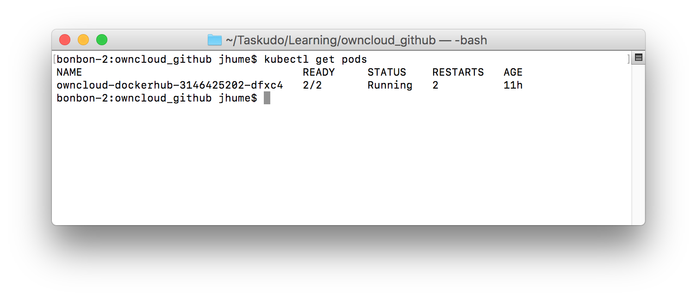
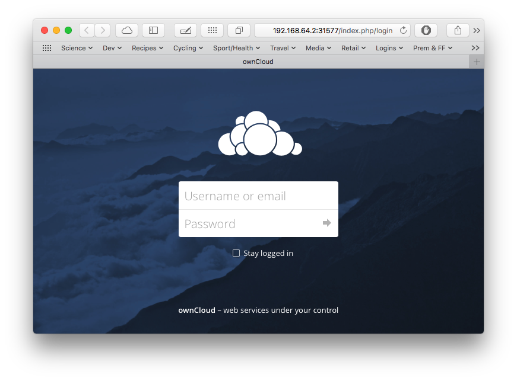
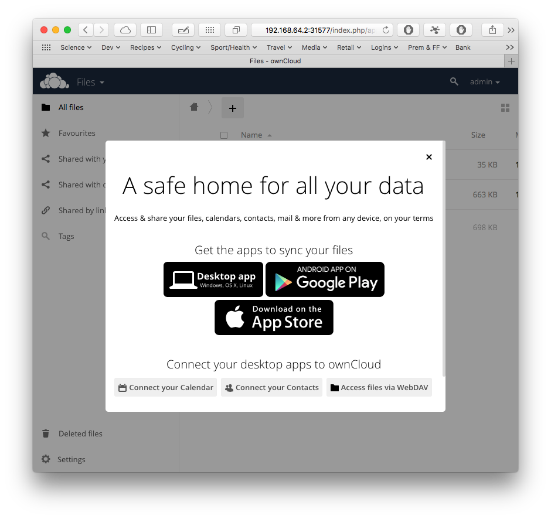
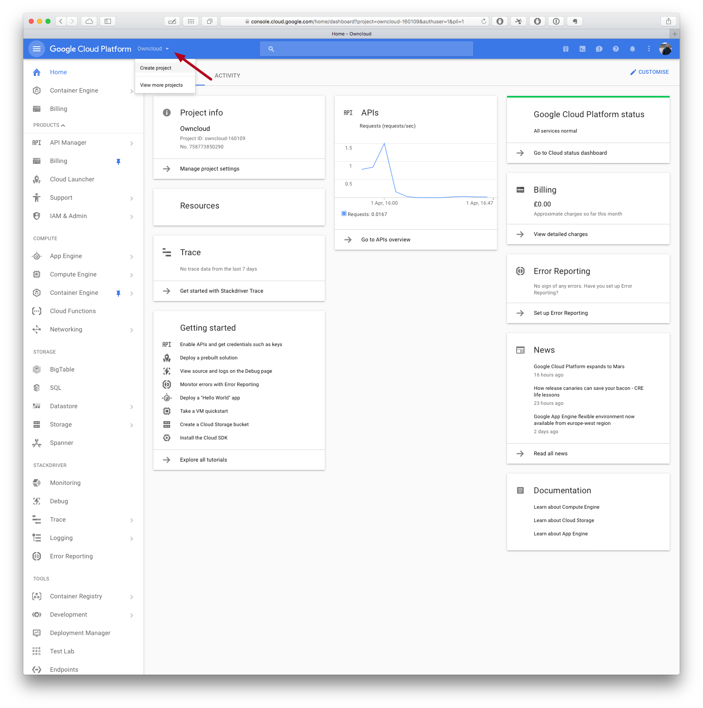
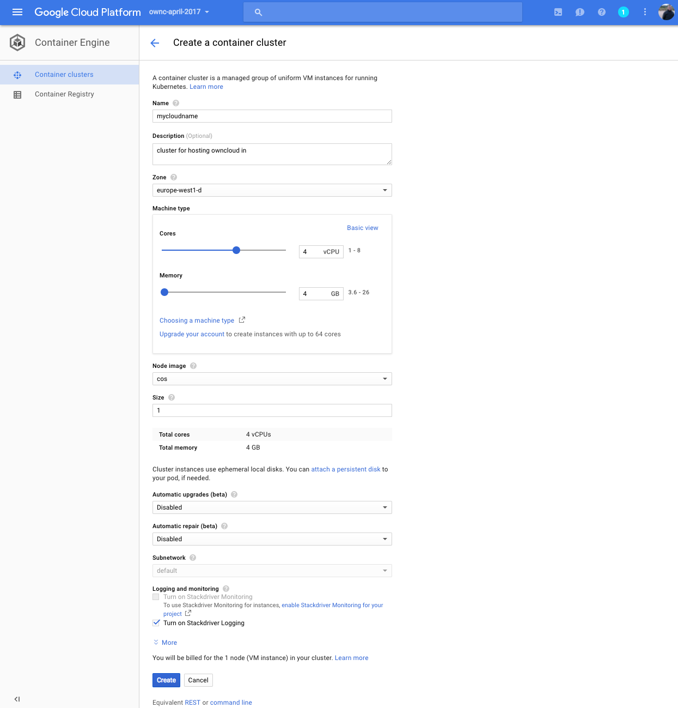
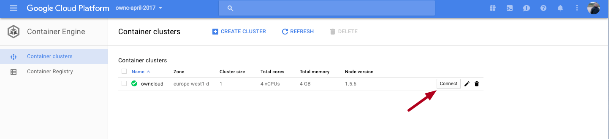
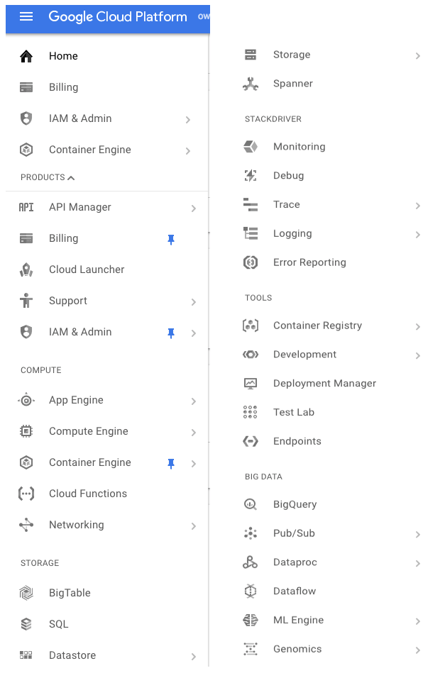
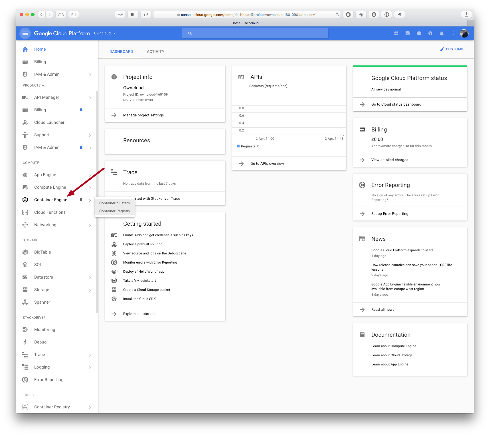
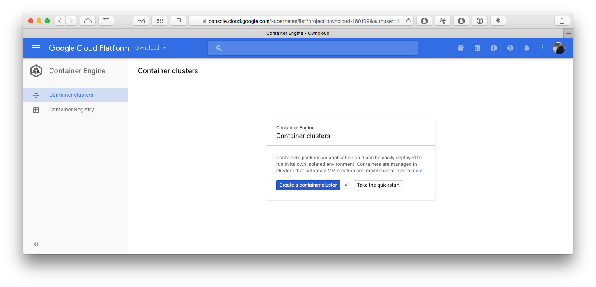
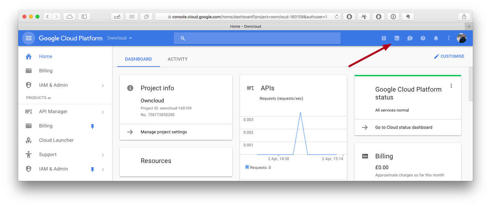

## Introduction and background

This is the third, and final, instalment of a series of blog posts documenting my learning journey whilst bootstrapping a working knowledge of Kubernetes for application deployment.

In the earlier dispatches I covered:
- The initial learning experience, using [Minikube and the official Kubernetes training materials](https://taskudo.info/blog/fun_with_minikube_and_the_kubernetes_io_tuts/)
- The first part of a learning reinforcement exercise, where I got a more substantial application [(ownCloud) running on Minikube](https://taskudo.info/blog/getting-owncloud-running-on-a-minikube-test-cluster/).

Rather than go over the general background again, if you'd like:
- An overview of what ownCloud is about and why it was picked.
- The rational behind the Kubernetes Pod/Container design.
- The general background to this series and how it relates to taskUdo.

Then please have a look at the earlier entries.

Here, instead the focus will be on the process of moving the ownCloud application that was previously working on Minikube, onto Google's Cloud Platform.

## Running ownCloud on Google's Cloud Platform

This section explains:

- How to run the application.
- Setup its dependencies both locally and in the cloud.
- The Kubernetes' configuration design.

### How to run the ownCloud application

To run ownCloud in this configuration requires the execution of the following steps:

1. Creating a Google Container Engine Kubernetes cluster, see [Creating a suitable GCP environment](#creating-a-suitable-google-cloud-platform-environment)

2. Retrieving the ownCloud configuration files from [GitHub](https://github.com/shufflingB/learning_k8s_owncloud/tree/gke_release) and changing into the repository's root directory, see [Obtaining the source code](#obtaining-the-source-code).

3. Creating the persistent storage volumes on Google's Compute Engine, either manually or using the supplied helper script, see [Creating the disk space](#creating-the-disk-space).

4. Reserving a fixed IP address for ownCloud using Google Compute Engine and updating the application's configuration with it, see [Obtaining a static IP address](#obtaining-a-static-ip-address) and [the Config Maps file](#config-maps-file).

5. Creating encrypted passwords for the ownCloud's 'admin' accounts and persisting them, see [Secrets file](#secrets-file).

6. In the Git repository's root directory (on the correct branch), running the command:  
  `kubectl create -f .`

   
  
  "What you will hopefully see from from kubectl create -f . when it works")

8. ... wait a while as the Containers are downloaded and their Pod is started, sometimes restarted [^WHY_RESTARTS], and application achieves a stable state in Kubernetes, use `kubectl get pods` to check this.
 "Pod status when system up")


9. Once both Containers in the Pod are up (`kubectl get pods` shows READY 2/2), then you should be able to visit the IP address created in step 4. and log in with username 'admin' and password set in step 5. The web pages you should see will look similar to the following.
 "System looking good, log in with 'admin' and password from step 5.")
 

"Welcome screen on first successful logging in"

10. Enjoy. You are now on your way to startup glory, maybe ;-)

### How to clean up

**Remove the Kubernetes objects and storage**

Each of the objects created can be manually removed from the system using the appropriate `kubectl delete k8s_obj_type owncloud_obj_name` command. For example, the following would remove ownCloud Deployment and terminate its Pod [^DEL_DEPLOYMENT]:

`kubectl delete deployment owncloud`

There are also two helper scripts supplied that automate this, namely `reset_k8s.bash` and `zap_EVERYTHING.bash`. These respectively, remove the installation from just Kubernetes or everything from Kubernetes **and** the persistent storage on the Google Compute Engine.

**Release the reserved IP address**

If you are completely finished with ownCloud on Google Container Engine, then the final step should be to release the reserved IP address to avoid incurring additional charges from Google [^STATIC_IP].

`gcloud compute addresses delete ip_addr_not_required`

### Obtaining the source code
The easiest way to experiment with this configuration is to clone a copy of its Git repository and run from the cloned directory. This can be done either:

1. With the complete repository, which will include other examples on alternative branches as they are published, using:  
    `git clone --branch gke_release https://github.com/shufflingB/learning_k8s_owncloud.git`

2. On its own, with no other examples, using:  
	`git clone --branch gke_release --single-branch https://github.com/shufflingB/learning_k8s_owncloud.git`

### Helper scripts

The example comes with a small selection of helper scripts that are intended to make testing a bit easier. These are:

- [`./helpers/create_persistent_disks.bash`](https://github.com/shufflingB/learning_k8s_owncloud/blob/gke_release/helpers/create_persistent_disks.bash) - This creates the static PersistentVolumes on Google Compute Engine.
- [`./helpers/mysql_connect_to_mariadb.bash`](https://github.com/shufflingB/learning_k8s_owncloud/blob/gke_release/helpers/mysql_connect_to_mariadb.bash) - Opens a MySQL client on the MariaDB container that is connected as root to the MariaDB instance. (can come in handy for checking and removing the ownCloud DB during testing cycles).
- [`./helpers/reset_k8s.bash`](https://github.com/shufflingB/learning_k8s_owncloud/blob/gke_release/helpers/reset_k8s.bash) - Removes everything related to the application from Kubernetes, but does not remove the PersistentVolume volumes from Google Compute Engine.
- [`./helpers/zap_EVERYTHING.bash`](https://github.com/shufflingB/learning_k8s_owncloud/blob/gke_release/helpers/zap_EVERYTHING.bash) - Removes everything related to the application from Kubernetes **and** the PersistentVolumes from Google Compute Engine.


**Warning**: The helper scripts are rudimentary and liable to break if things get renamed, moved around etc. Some of them, by their nature, can also be **destructive to operational systems**. The upshot of this is. that if you use them, then **use them with caution**.

So, if you have read through the helper script and are happy to proceed with it, then it can be invoked from repository directory using:

`bash ./helpers/helper_script_name`


### Creating a suitable Google Cloud Platform environment

 In order to develop and run the ownCloud application on the Google Cloud Platform (**GCP**) the following needs to be in place:

1. Local developer machines configured so that they can talk to GCP.
2. One, or more, Kubernetes clusters created in GCP's Google Container Engine (**GKE**)
3. Persistent disks and a static IP address assigned to the Kubernetes cluster from GCP's Google Compute Engine (**GCE**) resources.

Sounds simple, as always, there's a bit more fun to it than that though ...

#### Getting started with the GCP and the GKE part

If you have not used GCP before then you:

1. Need to sign up for [Google Cloud Platform's](https://cloud.google.com/free/) services. Google will want billing details, but they offer a good trial package that is unlikely to mean you will pay for anything whilst you get started [^GKE_TRIAL].
2. Optionally, but highly recommended to gain an understanding of the basic workflow, undertake GKE's quickstart tutorial (from 'Home'->Container Engine, the option should be prominently visible when no existing cluster is present [^GKE_FIRST_TIME]).

#### Local machine configuration

If you did the 'quickstart', then you'll have seen that it is possible to use Google's Cloud Shell [^CLOUD_SHELL] terminal in a browser web application for interacting with the service. However, I think for most of us, it is almost always a more productive experience working directly on our own machines.

To get this in place:

1. Install the GCP's SDK,  instructions for which can be found [here](https://cloud.google.com/sdk/downloads).
2. Optionally, but very highly recommended, set up extended command line autocompletions for the installed tools. There is an official guide for `kubectl` over [here](https://kubernetes.io/docs/tasks/kubectl/install/#enabling-shell-autocompletion) and I've written a more general guide for macOS that covers `kubectl`, as well as `gcloud` [here](https://taskudo.info/blog/installing-enhanced-bash-autocompletion-on-macos-aka-restoring-command-line-mojo/)

### Creating a GKE Kubernetes cluster for ownCloud

Once GCP is enabled and tools locally installed, then the next tasks on the list revolve around creating a GKE Kubernetes cluster for hosting our ownCloud application.

#### Optional, create a new GCP project

GCP provides Projects as a top-level mechanism for grouping together related dependencies across the whole of the platform. It is possible to work with everything in a single "default" project, but, if it is a viable option to do so, then administration complexity can be reduced by assigning each application own Project [^PROJ_COMPLEXITY].

For this reason, it might be a good idea to give the ownCloud application is its own Project, even if it's just to gain a little usage experience at this stage.

##### Creating the new Project

To create a new Project you can either use the  `gcloud` command line tool and its `projects` sub-command e.g.

```
gcloud projects create your_project_name
```

or

1. Go to the Google Cloud Platform
   [console](https://console.cloud.google.com/).
1. Create a new project from the dropdown

.

##### Enabling usage of the new Project

In order to work with a Project from the command line, such as the one that may just have been created, it has to part of an active configuration.

The `gcloud` tool has the ability to work with multiple configurations that can be activated, deleted and viewed as required. These are managed with sub-command `config configurations`, e.g. to see available configurations try:
```
gcloud config configurations list
```

If you've created a new Project, then you will also need to either:

- Create (and activate) a new configuration which is associated with that ownCloud Project, or,
- Update the current configuration to associate with it.

Doing the latter is simply a matter of:

```
gcloud config set project your_project_name
```

#### Creating the Kubernetes cluster

When you create a container cluster with GKE, it needs to know what:
- Zone the cluster should be in.
- What type of machine.
- How many nodes.

##### Picking a Zone for the cluster

GCP provides Zones as a way to help application developers create robust geographically (bandwidth) aware applications [^ZONES_RATIONAL]. Google has [extensive documentation on its Zones](https://cloud.google.com/compute/docs/regions-zones/regions-zones?hl=en_GB&_ga=1.154295736.105761145.1487802517). For a simple Personal Backend service, such as this example, our needs simplify dramatically to be to select the Zone with the:
- Best bandwidth connection to where we normally reside.
- Most appropriate hardware available for the task at hand.

As an example, I'm in the UK; according to the [currently available zones (April 2017)](https://cloud.google.com/compute/docs/regions-zones/regions-zones?hl=en_GB&_ga=1.154295736.105761145.1487802517#available), Google's experts [^LOC_EXPERTS] have located what looks like the best data centre for me in Belgium. I also want maximum flexibility in terms of available machines, so I'm going to go with the zone  `europe-west1-d` as that has the most modern machines available.

##### Choosing the Machine type and number of them (Nodes)

Any cluster created needs the ability to run:

1. Sufficient Pods for both the Kubernetes system and the application, or applications, on top of it.
2. The applications in a way that meets user performance and reliability requirements.

In each of its Zones, Google offers a selection of pre-defined [machine configurations](https://cloud.google.com/compute/docs/machine-types) that vary by CPU, memory etc, as well as, the ability to create custom ones. These can be combined with outright [Node numbers](https://kubernetes.io/docs/concepts/nodes/node/) (cluster size) to meet application requirements.

Picking the right configuration is likely to be a bit trial and error. However, getting it wrong is not normally that painful, as it's fortunately relatively easy to tune both the Machine type and number of Nodes in the cluster subsequently.

As a starting point, I think, allowing roughly one (virtual) CPU per container is reasonable during development:

- It allows a bit of flexibility to start additional diagnostic containers if needed.
- Facilitates slightly faster development cycles because deployments are less likely to be blocked pending Nodes being recycled.

Post development, the actual numbers in production can be tuned down if required.

Whilst if you are load balancing a Service for reliability, then it is sensible to ensure that there is a high likelihood of the Pods implementing the Service run on disjoint Nodes i.e. implying a cluster with lots of small Nodes. Against this is the additional complexity and cost, of running a large cluster of many Nodes.

All of this is interesting but possibly not that relevant for this example. I know that running ownCloud for one person works just fine on a single Node Minikube cluster on my laptop. So, for ownCloud on GKE I am going with a custom configuration based on the [previous Minikube setup](https://taskudo.info/blog/getting-owncloud-running-on-a-minikube-test-cluster/#creating-a-minikube-kubernetes-environment) of:

- 4 CPU's
- 4 GB of RAM
- 100 GB of Disk per Node.
- 1 Node


##### Creating the Kubernetes cluster

###### Web UI

Once you know the approximate shape of your cluster, then the easiest way to create it is through the GKE web interface's cluster creation dialogue. This can be found under Container Engine -> Container clusters -> Create Cluster.



###### CLI

It's also possible to create clusters from the command line using  `gcloud's`  `container clusters create` sub-command.

For instance the equivalent command line to the web-dialogue (including specification of all defaults) is the rather long-winded:

```
gcloud container --project "your_project_name" clusters create "mycloudname" --zone "europe-west1-d"  --machine-type "custom-4-4096" --image-type "COS" --disk-size "100"  --scopes "https://www.googleapis.com/auth/compute","https://www.googleapis.com/auth/devstorage.read_only","https://www.googleapis.com/auth/logging.write","https://www.googleapis.com/auth/servicecontrol","https://www.googleapis.com/auth/service.management.readonly","https://www.googleapis.com/auth/trace.append" --num-nodes "1" --network "default"  --enable-cloud-logging  --no-enable-cloud-monitoring
```

_**Tip**: If you need to use the command line, then you can use the GKE web creation dialogue to show you the equivalent CLI command. To do this, proceed as if you are going to configure with the web dialogue, then immediately before actually creating, look at the Equivalent "command line" link immediately below the "Create" and "Cancel" buttons)._

###### Connecting to the cluster and storing its credentials locally

It can take several minutes for the requested Kubernetes cluster to be spun up. However, once it's up, then before it can be used from a local developers machine, a second set of credentials has to be stored to access it.

To do this run a command similar to the following.

```
gcloud container clusters get-credentials mycloudname --zone europe-west1-d --project your_project_name
```

_**Tip** The command for connecting to a Cluster can be found in the web interface by clicking on the Connect button for the relevant cluster on the Container clusters page._



When everything is connected up, you should be able to see the Kubernetes Service running in the new cluster with the `kubectl get services` command, e.g.

```
$ kubectl get services
NAME         CLUSTER-IP    EXTERNAL-IP   PORT(S)   AGE
kubernetes   10.51.241.1   <none>        443/TCP   3d

```

##### Additional Resources

Rimantas Mocevicius, over on the Deis, has got a nice write up where he also goes through the process of setting up GKE https://deis.com/blog/2016/first-kubernetes-cluster-gke/

### Setting up the GCE dependencies

Once the GKE Kubernetes cluster is ready for use, then the external infrastructure on GCP has to be put in place to support the application.

#### Creating the disk space

In order to store the application's persistent data beyond the life of the Kubernetes objects, ownCloud's configuration needs disk volumes that exist outside of lifecycle of the Pods that use them.

Persistent storage volumes are represented in Kubernetes using the PersistentVolume type, and on GKE the underlying storage type to use is gcePersistentDisk.

Before the example will work, **each** volume **must be created** on GCE using the `gcloud` tool.

This can either be done manually or, as an alternative, a simple helper script is provided to automate it.

##### Manual creation
The volumes can be created manually by executing the command:

`gcloud compute disks create --size=your_size your_disk_name`

Where `your_size` and `your_disk_name` are the `storage` and `pdName` values from each of the PersistentVolumes sections in the  configuration file [`owncloud_pv.yaml`](https://github.com/shufflingB/learning_k8s_owncloud/blob/gke_release/owncloud_pv.yaml)

##### Using the helper script
The required volumes can be created automatically through the use of the bash helper script [`create_persistent_disks.bash`](https://github.com/shufflingB/learning_k8s_owncloud/blob/gke_release/helpers/create_persistent_disks.bash).

Warnings and details on how to use this are contained in the preceding _Helper Scripts section_.


#### Obtaining a static IP address

As a security feature, ownCloud restricts access to its web interface to that from a set of known IP addresses. In order to allow passing it this IP information at startup, it is necessary to obtain a static IP address from GCE to add to our Kubernetes configuration.

This can be done with a command similar to this:

```
gcloud compute addresses create --region=your_region owncloud 
```

where `your_region` is where your cluster has or will be created.

To see this IP addresses and any others in use:

```
 gcloud compute addresses list
```

### Kubernetes configuration

The Kubernetes configuration is identical to that previously used when working it on Minikube except where the specification interfaces to external systems. Namely, how it obtains it's disk volumes and IP address.

 To save repetition, I'll point to the Minikube example where appropriate and will only discuss the configuration files that are different.

#### Everything is labelled `app=ownCloud`

All Kubernetes objects that this application create are labelled `app=ownCloud`

More details on this can be found [here](https://taskudo.info/blog/getting-owncloud-running-on-a-minikube-test-cluster/#everything-is-labelled-appowncloud)

#### Persistent Volumes file

owncloud_pv.yaml defines which externally provisioned volumes are available to the system to subsequently claim.

Compared to the [definition used on the Minikube cluster](https://taskudo.info/blog/getting-owncloud-running-on-a-minikube-test-cluster/#persistent-volumes-file) the differences here are in the use of the GCE gcePersistentDisk persistent disk type and its associated configuration.


As mentioned [earlier](#creating-the-disk-space), each of the PersistentVolumes defined in the file has to be created before these objects can be created.

_**No updates should be needed to this file to run the example**_

<script src="https://gist-it.appspot.com/github/shufflingB/learning_k8s_owncloud/blob/gke_release/owncloud_pv.yaml"></script>

#### Config Maps file

General configuration options for the application are specified in the ConfigMap object definition that is stored in the owncloud_cm.yaml file.

_**Update to this file will be needed**_

The `owc_trusted_ip` value in this file needs to be updated to match the value [previously reserved with GCE](#obtaining-a-static-ip-address)

<script src="https://gist-it.appspot.com/github/shufflingB/learning_k8s_owncloud/blob/gke_release/owncloud_cm.yaml"></script>

#### Secrets file

Secure configuration information for the system is specified in the Secret object definition that is present in the `owncloud_secrets.yaml` file.

_**Updating the encoded passwords in this file will be needed**_

The Minikube and GKE configurations are identical, so for more information on this see the Minikube [post](https://taskudo.info/blog/getting-owncloud-running-on-a-minikube-test-cluster/#secrets-file)

#### Persistent Volume Claims file

The application's PersistentVolumeClaims objects are defined in the owncloud_pvc.yaml file.

_**No updates should be needed to this file**_

The Minikube and GKE configurations are identical, so for more information on this see the Minikube [post](https://taskudo.info/blog/getting-owncloud-running-on-a-minikube-test-cluster/#persistent-volume-claims-file).

#### Services file

The Service object specifies how to map a service to the Pod that is fulfilling it. The owncloud Service object is defined in the file owncloud_svc.yaml

_**Updating the IP address will be necessary**_

On GKE the type needs to be LoadBalancer, and for ownCloud we need it to be accessible from the previously [reserved GCE IP address](#obtaining-a-static-ip-address). To do enable this, the IP address has to be set as the value for loadBalancerIP parameter.


<script src="https://gist-it.appspot.com/github/shufflingB/learning_k8s_owncloud/blob/gke_release/owncloud_svc.yaml"></script>

#### Deployments file

The ownCloud application's Deployment object is defined in the owncloud_deploy.yaml file.

_**No updates should be needed to this file**_

The Minikube and GKE configurations are identical, so for more information on this see the Minikube [post](https://taskudo.info/blog/getting-owncloud-running-on-a-minikube-test-cluster/#deployments-file).

## Closing thoughts and observations

### Hard part - Understanding what's what on Google's Cloud Platform

One of GCP's strengths is also probably one of its biggest weaknesses. Namely, the sheer number of different products, services, their acronyms and where they've ended up in the user interfaces can at times be overwhelming.

For instance:
- How do I create a Kubernetes cluster? Is it under 'App Engine', 'Compute Engine', 'Container Engine' (right answer) or possibly 'Dataproc' (since that also mentions Clusters when I mouse over)
- What are "Spanner', "Cloud Functions", "Genomics" etc.
- Why, does disk space requested with gcloud show up under Compute Engine -> Disks, and not under Storage.



As a neophyte to GCP, I found probably the biggest time sink and the hardest part was in trying to determine which bits were important to the task. I suspect that most people working regularly with GCP use a fraction of what is available and never go near the rest. I can't help thinking that it would make their platform more attractive, especially to beginners, if Google enabled task-specific interfaces to their platform that reflected this [^IDEA].

### Developing on Minikube move to GKE for production works

One of the nicest parts of this stage of the exercise has been the small number of changes necessary to move between Minikube and GKE. Namely, all that needed changing was how the disk space was provided and the specification of the external IP address for the application.

For me, this validates that for small applications at least, developing them initially on Minikube and then subsequently moving them to GKE for production is a process that works quite nicely and is worth continuing with.


<!-- References below here -->


[^GKE_TRIAL]:   At the time (Jan 2017), giving you $300's worth of free credit and 60 days to spend it on any of Google's Cloud Platform services, since then they've improved this further by increasing the trial period to twelve months for all existing trial and new customers.

[^GKE_FIRST_TIME]: When you first start using Google's Cloud Platform many of the problems you'll face are knowing what it actually is that you want. In this case look in the sidebar for Container Engine.



    If you then select 'Container clusters' you should see something like this 


[^CLOUD_SHELL]: You can find this here 

[^PROJ_COMPLEXITY]: It's, as usual, a mixture of pros and cons, but if you use this level of separation then:

       1. You do not have to create and maintain your own ad hoc system for keeping application dependencies separate e.g. build something based on the use of Kubernetes namespaces and labels.
       2. The command lines used for administering individual applications are simpler and less prone to error, i.e. less need to remember to append command line options from any ad hoc system
       3. The system is easier to understand and likely to be more reliable.
       4. Communication between applications in different projects is more difficult.
       5. If you are running large high availability applications, then Pod provisioning may be more expensive because of the lost opportunity to share 'standby' resources across applications.

[^ZONES_RATIONAL]: i.e. applications that:

       1. Do not serve data to you over a wet piece of string from the other side of the world, and
       2. Die globally when the cleaner disconnects the rack on the other side of the world to plug the vacuum in.

[^LOC_EXPERTS]: Tax experts ;-)

[^STATIC_IP]: At the time of writing, static addresses that are being used by a Service are free. However, if they are not being used, then they become liable to a small additional charge for reserving them, so when finished, remember to remove them (`gcloud compute addresses delete ip_addr_not_required`).

[^WHY_RESTARTS]: Because the Maria DB and the ownCloud containers are started asynchronously, the ownCloud container can fail to start a few times before the Maria DB one is operational, particularly on the first run.


[^DEL_DEPLOYMENT]: NB: Deleting the Deployment still potentially leaves behind the Service, ConfigMap, Secret, PersistentVolumeClaims and PersistentVolumes.


[^IDEA]: The most obvious idea would be to offer some sort of guided wizard to configure the web UI on Project instantiation.